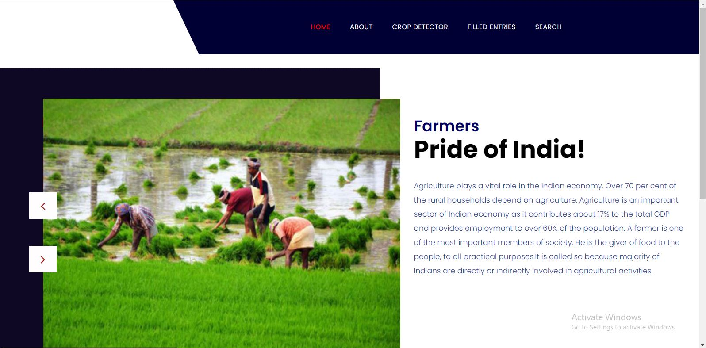
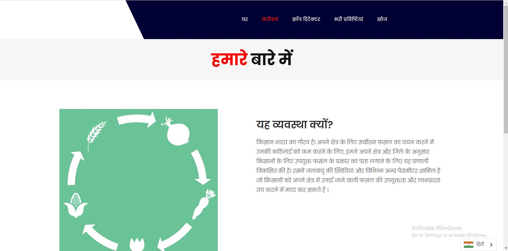
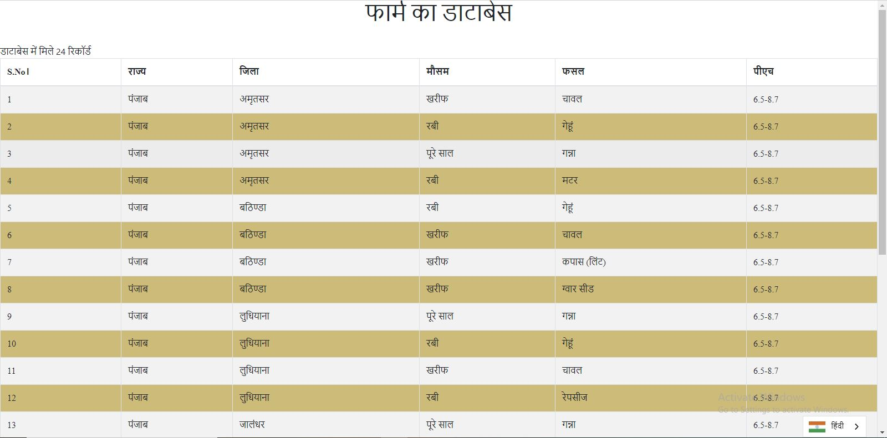
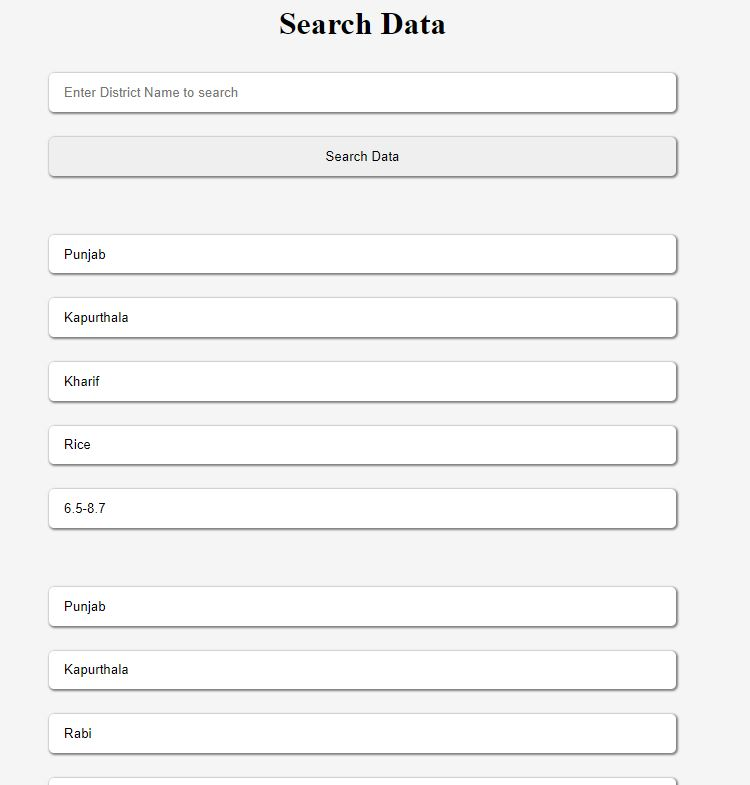

# Team-Dreamers
Innerve Hacks

India has a large population of people with people involved in different fields of work. 
But the majority of the people are employed in agricultural activities for their livelihood, most of them being farmers.

-> We thought of an idea of developing a website such that 
   it helps in improving the lives of farmers and provide them with an effective method to deal with their day-to-day problems. 

-> To ease out their difficulty in selecting the best crop for their area,
   we have developed this system to detect the type of crop suitable to farmers according to their area and district.

-> This includes the climatic conditions and various other parameters
   which can help the farmers decide the suitability and profitability of the crop to be grown in his area.

OUR SOLUTION
We have tried to build a user-friendly, 
easily accessible website which provides farmers all the necessary information about various parameters 
like which crop they can grow, in which season for different districts.

Some glimpses of the website :

